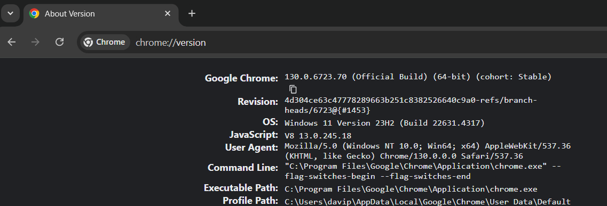

# IM

Execute the following command to install all the python ibraries requirements
```ps
pip install -r requirements.txt
```
# How to run
 ## First Step
  Open a `terminal` in this directory and start the `mmiframework` with this commands:
  
  **VOICE Project:**
   ```ps
   cd .\Voice\mmiframeworkV2\; ./start.bat
   ```

  **GESTURES Project:**
   ```ps
   cd .\Gestures\IM\; ./start.bat
   ```

   ## Second Step
   Open another `terminal` in this directory and star the `Fusion Engine` with the following command:

  **VOICE Project:**

   ```ps
   cd .\Voice\FusionEngine\; ./start.bat
   ``` 

  **GESTURES Project:**

   ```ps
   cd .\Gestures\FusionEngine\; ./start.bat
   ``` 

   ## Third Step
  **VOICE Project:**

  Open a `Anacond Prompt (Miniconda3)` and execute this command:

   ```bat
    activate rasa-env &&  cd .\rasa\
  ```

  If it is your `first` time running this project or you made `any change` of a file in the `rasa folder`, before tou start the `rasa server` you need to execute the following command to generate a new `rasa model`
  ```bat
  rasa train
  ```
  Otherwise you can run this command, to start the `rasa server`
  ```
  rasa run --enable-api -m .\models\ --cors "*"
  ```

  **GESTURES Project:**
   ```bat
    cd .\Gestures\GenericGesturesModality-2023\; .\GenericGesturesModality.exe
  ```

  Proper Kinect interaction requires careful positioning of the user's **upper body**. The optimal capture zone spans a **distance between 1.5 and 2 meters from the sensor**. Within the application's GenericGesturesModality interface, users can monitor real-time tracking and gesture recognition. This interface also provides detailed feedback, including the specific gesture detected and its recognition confidence level.If a black window appears within the GenericGesturesModality, check that the Kinect is correctly connected.

  ## Fourth Step
  To start the `web app server` open a `terminal` in this folder and execute the following command

  **VOICE Project:**
  ```ps
   cd .\Voice\WebAppAssistantV2\;   ./start_web_app.bat
  ```

  **GESTURES Project:**	
  ```ps
   cd .\Gestures\WebAppAssistantV2\;   ./start_web_app.bat
  ```

  ## Fifth Step
   To run our `assistant` open a `terminal` in this folder and execute the next command
   ```ps
   cd ./assistant/; ./app.bat
   ```

  ## Last Step
   Ensure your chrome profile is set in the directory `C:\Users\{user}\AppData\Local\Google\Chrome\User Data\Default`. 
   To check this path open the google chrome and write `chrome://version/`, like in the picture below

   

   After that make sure your `google account` is logged in `youtube`.

  ## Optional Step
  In case the last step didn't work, when you run "cd ./assistant/; ./app.bat" you maybe saw a message like this:
  ```ps
    (session not created: DevToolsActivePort file doesn't exist)
    (The process started from chrome location C:\Program Files (x86)\Google\Chrome\Application\chrome.exe is no longer running, so ChromeDriver is assuming that Chrome has crashed.) 
  Stacktrace: 
              ...
              ...
    [19312:12548:1031/232204.442:ERROR:command_buffer_proxy_impl.cc(324)] GPU state invalid after WaitForGetOffsetInRange.
  ```
  Try to run the following command in the terminal:
  ```ps
      taskkill /F /IM chrome.exe /T
  ```
  And then run the assistant again.
  This command will kill all the chrome processes running in the background. We need to do this or the assistant will not work properly.

# Guia de Utilização do Assistente de Vídeo

## Pesquisa de Vídeos

- "Procura o vídeo [video]"
- "Pesquisa pelo vídeo [video]"

## Controlos de Reprodução de Vídeo

### Reprodução Básica

- **Reproduzir**: Utilizar comandos como "Continuar", "Retome" ou "Proceda com o vídeo"
- **Parar**: Dizer "Parar o vídeo" ou "Pausar o vídeo"

### Navegação no Vídeo

- **Avançar/Recuar**: Avançar ou recuar no vídeo por um período específico de tempo
  - Exemplo: "Avançar 10 minutos" ou "Recua 30 segundos"
- **Alterar Velocidade de Reprodução**: 
  - Aumentar: "Aumenta a velocidade do vídeo em 1,5"
  - Diminuir: "Baixe a velocidade do vídeo em 0,5"
  - Definir Velocidade Específica: "Mude a velocidade do vídeo para 1,75"

### Áudio e Legendas

- **Silenciar/Ativar Som**: 
  - "Silenciar o som" ou "Desligar som"
  - "Ativar som" ou "Ligar som"
- **Legendas**: 
  - "Ativar legendas"
  - "Desativar legendas"

## Funcionalidades de Interação

### Gestão de Canais e Vídeos

- **Subscrever/Anular Subscrição**: 
  - "Subscrever este canal"
  - "Anular subscrição deste canal"
- **Notificações (Só funciona depois de ser efetuada a subscrição)**: 
  - "Ativa as notificações do canal"
  - "Desativa as notificações"
  - "Quero manter as notificações"

### Partilha e Guardar

- **Partilhar Vídeo**: 
  - "Partilha este vídeo com o [Nome]"
- **Guardar Video numa Playlist**: 
  - "Guarda este vídeo na playlist [Nome da Lista]"
- **Comentar**: 
  - "Comentar '[Sua mensagem]'"

## Interações Adicionais

- **Terminar Conversa**: Utilizar expressões como "Adeus", "Até logo", "Até à próxima"
- **Confirmar/Negar**: Responder com "Sim", "Não", "Está bem"
- **Seleção de Itens (o Assistente pedirá ao utilizador, quando for necessário )**: Escolher itens dizendo "Selecionar o primeiro", "Selecionar o segundo", etc.
